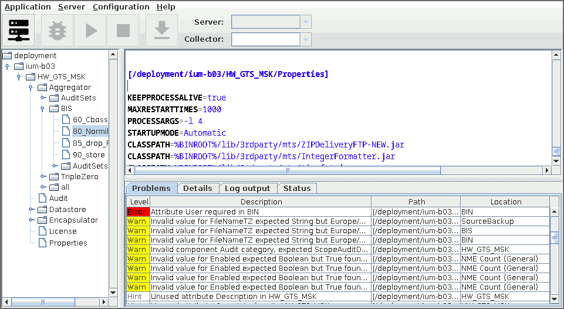

# SIU configuration editor

Simple editor for SIU configuration files. Editor sopport basic valiudation,
checks and autocomletions.

## License
[license]: #license

Source code is primarily distributed under the terms of the MIT license. See LICENSE for details.
